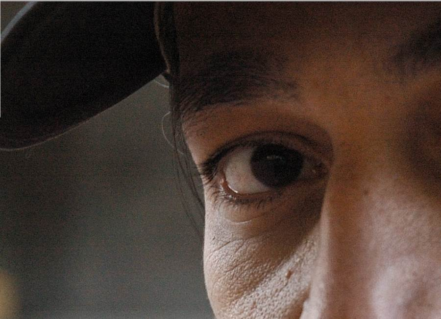
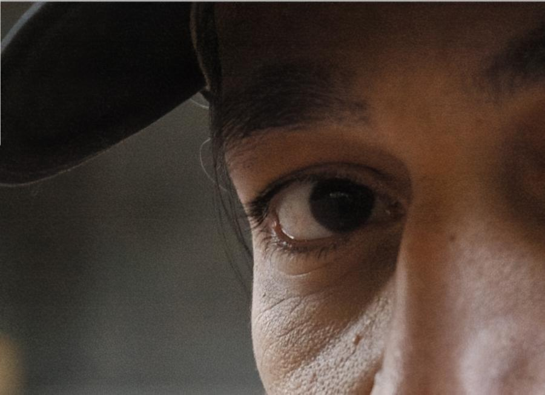
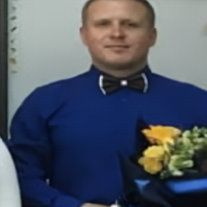

# UNet Denoiser - Удаление шума с фотографий с помощью глубокого обучения

> **PyTorch-модель для шумоподавления. Архитектура: UNet + Residual Learning + PixelUnshuffle + Channel/Window Attention. 
Подавляет гауссовский, пуассоновский шум и JPEG-артефакты. Метрики: PSNR 40.1 дБ (SIDD), 31.8 дБ (DIV2K).**
> 
---

## Навигация
- [Особенности](#особенности)
- [Архитектура модели](#архитектура-модели)
- [Результаты](#результаты)
- [Веса модели](#веса-модели)
- [Установка](#установка)
- [Использование](#использование)
- [Обучение модели](#обучение-модели)
- [API Reference](docs/API.md)
- [Структура проекта](#структура-проекта)

---

## Особенности

- **Современная архитектура**: модифицированный UNet с блоками `UNetResBlock` (LayerNorm, SimpleGate, ChannelAttention) и оконным вниманием `WindowAttention` в бутылочном горле.
- **Остаточное обучение**: модель предсказывает не чистое изображение, а карту шума, что упрощает обучение и сохраняет детали.
- **Обратимое изменение разрешения**: используются `PixelUnshuffle` / `PixelShuffle` вместо пулинга.
- **Комбинированная функция потерь**: L1 + SSIM + Perceptual (VGG16) с поэтапным изменением весов.
- **Поддержка смешанных шумов**: обучена на реальных шумах смартфонов (SIDD) и синтетических (гауссовский, пуассоновский, JPEG-артефакты).
- **Простой инференс**: класс `ImageDenoiser` загружает веса и обрабатывает изображения любого размера с автоматическим паддингом до кратности 32.

---

## Архитектура модели

Базовая сеть - UNet с 4 уровнями энкодера/декодера. Ключевые улучшения:

- **Энкодер**: два уровня с понижением через `PixelUnshuffle` + Conv1x1.
- **Бутылочное горло**: два `UNetResBlock` + `WindowAttention` (окна 8x8, 8 голов).
- **Декодер**: апсэмплинг через Conv1x1 + `PixelShuffle`, конкатенация со skip-соединениями.
- **Выход**: остаточное вычитание предсказанного шума из входного изображения.

Подробное описание и обоснование каждого компонента - в [дипломной работе](https://docs.google.com/document/d/1A6lJsdqdsUMtUgSb54sA0_n4NOM89cCP/edit?usp=sharing&ouid=102739825177010421332&rtpof=true&sd=true).

---

## Результаты

Модель тестировалась на двух независимых наборах:

| Датасет | Тип шума | PSNR (вход -> выход) | SSIM (вход -> выход) |
|---------|----------|---------------------|---------------------|
| **DIV2K** (синтетический) | AWGN + Poisson + JPEG | 15.17 -> **31.82 дБ** | 0.341 -> **0.884** |
| **SIDD** (реальный) | Шум смартфонных матриц | 31.98 -> **40.11 дБ** | 0.709 -> **0.971** |

> Все метрики усреднены по тестовой выборке из 5000 патчей (DIV2K) и 1200 патчей (SIDD).

 

 

---
## Веса модели 
Ссылка для скачивания:
[best_weights.pth (Google Drive)](https://drive.google.com/file/d/1CTy4pj0JQTCuuzCJuI_IUGdtxZWjwI9k/view?usp=sharing)

## Установка

1. Клонируйте репозиторий:
```bash
git clone https://github.com/Lol547/ResidualDenoisingNet.git
cd ResidualDenoisingNet
```

2. Установите зависимости:
```bash
pip install -r requirements.txt
```
> 
**Требования**:
- Python 3.8+
- PyTorch (с поддержкой CUDA, если есть GPU)
- torchvision, Pillow, matplotlib, numpy

---

## Использование

### Быстрый старт

```python
from inference import ImageDenoiser

# 1. Инициализация с путём к весам
denoiser = ImageDenoiser("checkpoints/best_weight.pth")

# 2. Обработка одного изображения
orig_img, clean_img = denoiser.process_image("test_images/noisy_photo.jpg")

# 3. Сохранение результата
denoiser.save_result("test_images/noisy_photo.jpg", clean_img)
```

### Интерактивное сравнение "до/после"

```python
# После обработки вызываем слайдер
denoiser.show_interactive_slider(orig_img, clean_img)
# Появится окно с ползунком - закрыть для продолжения
```

### Обработка с сохранением в произвольный путь

```python
denoiser.process_and_save("input.jpg", "output/clean.png")
```

> Поддерживаются форматы: `.jpg`, `.png`, `.bmp`, `.tiff`. Результат сохраняется в `.png` без потерь.

---

## Тестирование

Запустите тестовый скрипт для обработки заранее подготовленных изображений:

```bash
python test.py
```

(пути к файлам можно изменить внутри `test.py`).

---

## Обучение модели

### Подготовка данных

1. Скачайте датасеты:
   - [SIDD](https://www.eecs.yorku.ca/~kamel/sidd/) - реальные шумы.
   - [DIV2K](https://data.vision.ee.ethz.ch/cvl/DIV2K/) - чистые изображения высокого разрешения.

2. Сгенерируйте зашумленные версии для DIV2K с помощью скрипта `data/generate_noise.py`.

3. Нарежьте изображения на патчи 256x256 с шагом 128 и отфильтруйте по стандартному отклонению (σ ≥ 15).

4. Разместите данные в структуре:
```
processed/
├── sidd_real/
│   ├── train/clean/ & noisy/
│   ├── val/clean/ & noisy/
│   └── test/clean/ & noisy/
└── synthetic_div2k/
    ├── train/clean/ & noisy/
    ├── val/clean/ & noisy/
    └── test/clean/ & noisy/
```

### Запуск обучения

Отредактируйте `train.py`, указав пути к данным:
```python
BASE_DIR = r"путь_к_папке_processed"
```

Затем выполните:
```bash
python train.py
```
### Этапы обучения

Обучение проходит в **5 последовательных этапов** с постепенным усложнением функции потерь и изменением скорости обучения. Краткая сводка:

| Этап | Эпохи | Функция потерь | Особенности |
|------|-------|----------------|-------------|
| 1    | 0-40  | L1 + SSIM (0.8 / 0.2) | Стартовый LR = 5e-4, AdamW, косинусное затухание |
| 2   | 40-42 | L1 + SSIM (0.5 / 0.5) | Усиление структурной компоненты |
| 3  | 42-60 | Только L1         | Перезагрузка обучения, Adam (без весов) |
| 4   | 60-70 | L1 + SSIM + VGG (0.3 / 0.6 / 0.1) | Введение перцептивной потери |
| 5    | 70-75 | L1 + SSIM + VGG (0.3 / 0.7 / 0.25) | Финальный баланс, низкий LR |

Полная таблица с параметрами (оптимизатор, LR, планировщик) - в [docs/TRAINING.md](docs/TRAINING.md).
---

## Структура проекта

```
unet-denoiser/
├── README.md
├── requirements.txt
├── .gitignore
│
├── inference.py          # Класс для инференса
├── train.py              # Скрипт обучения (включает модель)
├── test.py               # Простой тест
│
├── models/
│   ├── unet_denoiser.py
│   └── losses.py
│
├── data/
│   ├── slice_patches.py
│   └── generate_noise.py
│
├── results/              # Сюда сохраняются обработанные изображения
│
└── utils/                # Вспомогательные функции (метрики, датасеты)
    ├── dataset.py
    └── metrics.py
```

---

## Контакты

По вопросам  или найденным ошибкам пишите: sokolovkirill489@gmail.com TG: @qqkiru
